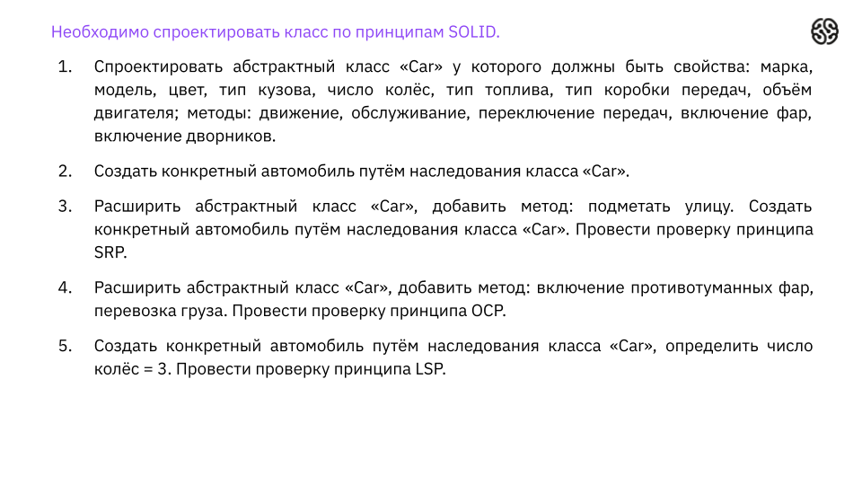

># **Семинар 3. Принципы SOLID**

> **Домашнее задаание:** Реализовать класс Car(можно по примеру из презентации),реализовать в нём минимум 3 принципа solid

> Для выполнения домашнего задания использовалась задача из презентации к уроку:

>**Ход выполнения домашнего задания:**
* Сперва создали абстрактный класс и наполнили его, при этом такие параметры, как цвет, тип кузова, число колес, тип топлива, тип коробки передач были вынесены отдельно.
* Создали конкрентый автомобиль Truck1 путем наследования
* Создали интерфейс SkillsCar, который позволяет добавлять специальизацию к автомобилю путем имплеминтирования интерфейса ( таким образом мы выполнили принцип разделения интерфейсов и принцип инверсии зависимостей)
* При добавлении метода включения противотуманных фар, было принято решение вынести управление светом автомобиля, который изначально был заложен в Car в отдельный интерфейс для разгрузки основного класса (соблюдения принципа разделения ответственности)
* Принцип Открытости - закрытости также выполняется, т.к основные харвктеристики защищены модификатором private, а дополнительные функции открыты для дополнений. 
* В Main мы создали конкретный автомобиль KAMAZ и протестировали работоспособность системы. 
